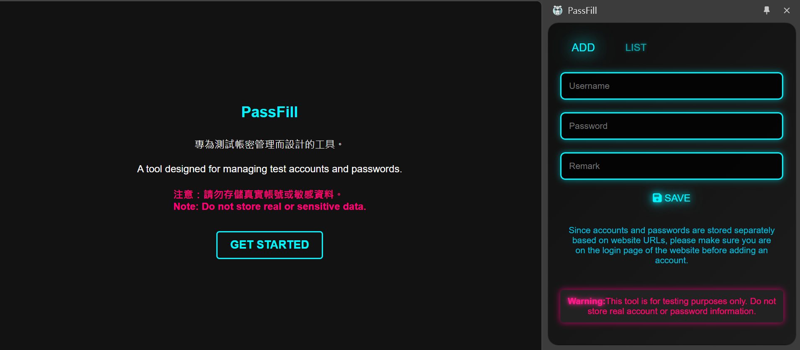
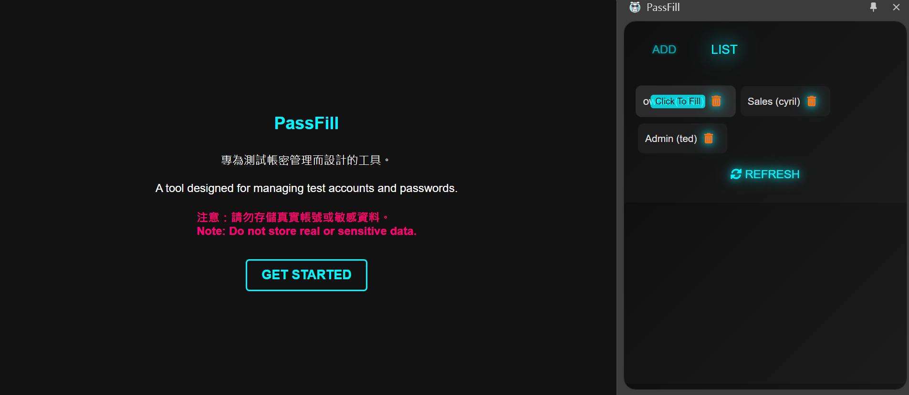

# PassFill - Test Account Autofill

PassFill is a Chrome extension designed for developers and testers to efficiently manage test accounts and passwords, improving productivity in testing environments.

## Important Notes
- **Do not store real or sensitive data**: This tool is designed for testing purposes only and is not intended for use as a password manager.

## Features
- **URL-based storage**: Manage accounts and passwords specific to each URL to avoid confusion.
- **Autofill**: Automatically fill in passwords with one click.
- **Encrypted local storage**: Uses Web Crypto API to ensure password security.

## Screenshots

### Add Account Interface


### Account List



## Installation

1. **Clone or download the repository from GitHub**:
   ```bash
   git clone https://github.com/cyril1018/passfill-extension.git

2. **Load the extension in Chrome**: Open Chrome and navigate to chrome://extensions/, enable Developer Mode, and click Load unpacked.
